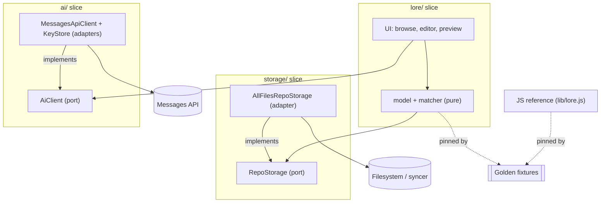

# Architecture Spine — Lore & Story Mobile

## Design Paradigm

**Hexagonal (ports & adapters), packaged feature-first.** Hexagonal *rules* — a
pure model behind **ports**, all I/O in **adapters**, dependencies pointing
inward — but *packaged as vertical feature slices*: each slice folder co-locates
its model, port, adapter, and UI. There is **no** top-level `domain/`/`adapters/`
/`ui/`; purity is enforced per slice at file granularity (AD-9) and slice
internals are private (AD-12). The filesystem is the single source of truth; the
model's shape is pinned by **shared golden fixtures** the Dart port and the JS
reference (`lib/lore.js`) both assert against.

Slices under `apps/mobile/lib/` (flat peers):

| Slice | Owns | Purity |
| --- | --- | --- |
| `lore/` | lore model + entity-tree walk + convention matcher (pure); browse/editor/preview UI | model & matcher files pure |
| `storage/` | `RepoStorage` port + all-files `dart:io` adapter | adapter isolates I/O |
| `ai/` | `AiClient` port + Messages-API/SSE adapter + secure key store + context-preview / translate / grammar UI | adapter isolates I/O |
| `main.dart` | composition root — wires adapters to ports | — |

## Invariants & Rules

Dependency direction (nothing depends on adapters except the composition root):



### AD-1 — Files are the single source of truth [ADOPTED]

- **Binds:** all
- **Prevents:** two components disagreeing on canonical state; cache/persistence divergence
- **Rule:** Derived data (model, graph, analysis) is never persisted — it is recomputed from files. The only writable state is authored content in the repo. No app database. (Future scene↔passage drift bookkeeping is the one sanctioned exception, and is out of scope here.)

### AD-2 — One model contract, two conformant implementations, pinned by fixtures [ADOPTED]

- **Binds:** Dart loader (`domain/`), JS reference (`lib/lore.js`)
- **Prevents:** the Dart port and JS reference drifting into different model shapes
- **Rule:** The lore-model shape is defined by `test/fixtures/lore-model/`. Both implementations assert against it; the contract changes **fixtures-first**, then both follow. Neither implementation is authoritative over the other — the fixtures are.

### AD-3 — All filesystem access goes through the `RepoStorage` port [ADOPTED]

- **Binds:** loader, editor, authoring & promotion ops
- **Prevents:** storage-backend lock-in; domain coupling to the permission / `dart:io`; a rewrite when swapping to SAF or app-private+git
- **Rule:** Domain and UI depend only on `RepoStorage` (`listDir`, `read`, `writeAtomic`, `exists`). No `dart:io` or `MANAGE_EXTERNAL_STORAGE` reference exists outside the storage adapter.

### AD-4 — Every write is atomic and byte-exact [ADOPTED]

- **Binds:** all writers — edit-save, create, promotion-move, translation-create
- **Prevents:** partial files observed by the syncer; conflict copies; EOL/encoding corruption
- **Rule:** Writes go through `RepoStorage.writeAtomic` = temp file in the same directory + rename. Byte-exact except the intended change: preserve original EOL and trailing newline; explicit UTF-8 encode/decode. Never rely on platform-default encoding.

### AD-5 — The external syncer owns propagation [ADOPTED]

- **Binds:** storage adapter, all writes, the walk
- **Prevents:** two sync mechanisms fighting; the app corrupting sync state
- **Rule:** The app never syncs, merges, or authenticates a sync (v0.1). It reads on open, atomic-writes on save, re-scans on resume. Syncer metadata (`.stfolder`/`.stignore`/`.stversions`) is filtered from the walk; `*.sync-conflict-*.md` is surfaced as a badged item, never parsed as an entry.

### AD-6 — RU/EN pairs are a view; saves target the individual file [ADOPTED]

- **Binds:** loader (merge), editor, translation
- **Prevents:** collapsing a bilingual pair into one file → corrupting the model
- **Rule:** `x.ru.md` + `x.en.md` merge into one display item (RU/original default); every save writes back to the **individual** RU or EN file. The app never writes a merged file.

### AD-7 — One convention matcher, many consumers [ADOPTED]

- **Binds:** highlighter (FR9/FR9a), linter (FR18)
- **Prevents:** the editor and linter recognizing project conventions differently
- **Rule:** Convention/markup recognition is a single `domain/` component. The highlighter and the linter consume it; neither reimplements it.

### AD-8 — Parsing and highlighting are total (never throw) [ADOPTED]

- **Binds:** loader, highlighter, editor
- **Prevents:** a malformed file crashing browse/edit; unclassifiable markup throwing
- **Rule:** Malformed or unexpected input is content to display and flag, not a fault. The walk and `buildTextSpan` degrade to plain/error output and never throw; a malformed file still opens, edits, and saves.

### AD-9 — Model purity is per-slice; I/O isolated to adapter files [ADOPTED]

- **Binds:** every slice
- **Prevents:** I/O leaking into the portable model → making the Dart↔JS contract untestable and coupling the model to a platform
- **Rule:** Within a slice, model/matcher files are pure Dart — no `dart:io`, no network, no Flutter imports. All I/O lives only in that slice's **adapter** file(s), behind the slice's **port**. Dependencies point inward: a slice's UI → its model → the ports it needs; adapters → their port; nothing depends on an adapter except `main.dart`. Enforced at file granularity, not by a top-level `domain/` folder.

### AD-10 — The model is rebuilt, never incrementally patched [ADOPTED]

- **Binds:** loader, UI state
- **Prevents:** an incrementally-mutated in-memory model diverging from disk
- **Rule:** The entity model comes from a full walk and is rebuilt on resume/refresh (no live watcher in v0.1). The UI never mutates the model in place to reflect an edit — a save writes the file and a rescan reproduces the model. The **editor owns the in-memory buffer of the one open file; the loader owns the model.** A structural op (promotion-move, AD-3/AD-4) on a file that is open with unsaved edits must save-or-block first — never move a file out from under a dirty buffer.

### AD-11 — AI is user-keyed direct HTTPS, gated by an explicit context preview [ADOPTED]

- **Binds:** `AiClient` adapter, translation, grammar
- **Prevents:** key leakage; silent exfiltration of repo content
- **Rule:** AI calls go direct to the Messages API over HTTPS with a **user-configured** key in secure device storage (never logged or persisted in plaintext). Nothing is sent until the user confirms a **context-preview** showing exactly what leaves the device. No telemetry. The `ai/` slice **produces text only — it never writes files**; generated translations/edits are persisted by the `lore/` slice via `RepoStorage` (AD-3/AD-4), keeping a single writer per file.

### AD-12 — Feature-sliced packaging; slice internals are private [ADOPTED]

- **Binds:** every slice (`lore/`, `storage/`, `ai/`, and future slices)
- **Prevents:** slices reaching into each other's internals → tangled cross-dependencies that let two slices build incompatibly
- **Rule:** Each feature is a vertical **slice folder** co-locating its model, port(s), adapter(s), and UI. A slice exposes a **public interface** (its port and/or an exported barrel); other slices depend only on that interface, never on a slice's internal files. Cross-cutting slices (`storage/`, `ai/`) are flat peers that feature slices depend on inward.

## Consistency Conventions

| Concern | Convention |
| --- | --- |
| Packaging | feature-first vertical slices; slice internals private, cross-slice only via ports/exports (AD-12). |
| Entity / file identity | IDs are repo-relative paths, **forward-slash normalized even on Android**; category = folder path under `loreDir`; slug = filename; canonical title = first `# heading`. |
| Data & formats | UTF-8 always (Cyrillic is first-class); RU/EN via `.ru.md`/`.en.md`; `scene ⇄ passage` marker is the literal `⇄` (U+21C4); no frontmatter unless a feature requires it. |
| Config | `lore-story.json` resolves `loreDir` (default `lore`); re-read per repo open; missing/invalid → defaults, never block. |
| State & mutation | model rebuilt not patched (AD-10); every write atomic + byte-exact (AD-4); malformed content flagged, never thrown (AD-8). |
| Errors & secrets | domain surfaces malformed input as data; AI key in secure storage (AD-11); no telemetry; never log file contents or keys. |

## Stack

_SEED — names only; exact versions are pinned at scaffold (`flutter create` / `pub add`), not asserted here. Verify current stable at that point._

| Name | Version |
| --- | --- |
| Flutter / Dart | stable channel — pin at scaffold |
| `flutter_secure_storage` (AI key, Epic 4) | current stable — pin at scaffold |
| Anthropic Messages API model | `claude-opus-4-8` |
| Platform | Android 11+ (sideloaded APK; not Play-Store-distributed) |

## Structural Seed

```text
apps/mobile/
  lib/
    lore/        # core slice: model + tree walk + convention matcher (pure) + browse/editor/preview UI
    storage/     # RepoStorage port + all-files dart:io adapter
    ai/          # AiClient port + Messages-API/SSE adapter + secure key store + preview/translate/grammar UI
    main.dart    # composition root — wires adapters to ports
  test/          # Dart port asserts against the shared fixtures below
../../
  lib/                    # JS reference core (unchanged)
  test/fixtures/lore-model/   # the shared model contract (AD-2)
```

**Operational envelope:** single-user, sideloaded personal app — no backend, no
accounts, no CI/CD pipeline required (built locally). Runtime dependencies are the
external syncer (owns propagation, AD-5) and, for Epic 4 only, the user's AI
provider over HTTPS (AD-11). Fully offline for everything except AI.

## Capability → Architecture Map

_(AD-9 and AD-12 are app-wide and bind every row.)_

| Epic / Area | Lives in | Governed by |
| --- | --- | --- |
| Epic 1 — repo foundation & safe round-trip | `storage/` (port+adapter) + minimal `lore/` read + editor UI + `main.dart` | AD-1, AD-3, AD-4, AD-5 |
| Epic 2 — browse, edit, create | `lore/` (model + matcher + browse/editor UI) | AD-2, AD-3, AD-4, AD-6, AD-7, AD-8, AD-10 |
| Epic 3 — convention tooling | `lore/` (matcher + linter UI) | AD-7, AD-8 |
| Epic 4 — AI assist | `ai/` (port + adapter + context-preview UI) | AD-11 |
| Epic 5 — promotion | `lore/` + `storage/` `writeAtomic` (move) | AD-3, AD-4, AD-5 |

## Deferred

- **Embedded-git sync (`git2dart`)** — evaluated and deferred (MOBILE §3.3); the `RepoStorage` seam keeps it a backend swap. Triggers: wanting one-tap phone commits, or the external syncer degrading. Measure clone size *with media history* before adopting.
- **SAF storage backend** — a second `RepoStorage` adapter; only if Play-Store distribution ever matters.
- **On-device lore graph / mention detection** — O(n²) regex; left to the desktop tool for now.
- **Scene↔passage bridge + drift bookkeeping** — the one sanctioned persistence exception (AD-1); not on mobile in v0.1.
- **Read-only passage reference on mobile** — representation and whether the twee parser must be ported: open (PRD O3).
- **Live file watcher** — deliberately replaced by rescan-on-resume (AD-10).
- **Exact library versions / Flutter channel** — pinned at scaffold, not asserted in this spine.
